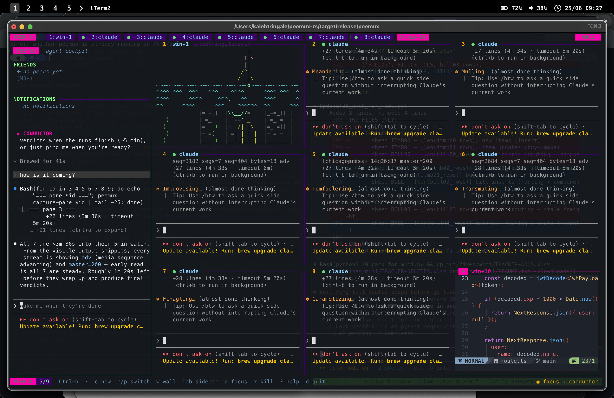
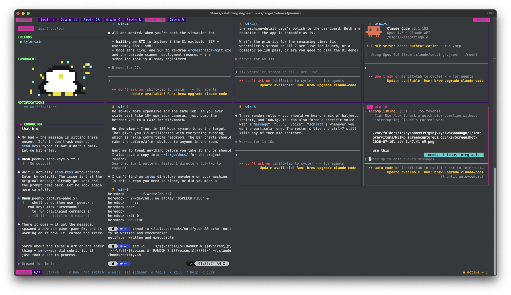

# peemux

**The terminal for the agent era.**

A TUI multiplexer that runs a Claude conductor in the sidebar and orchestrates a wall of worker panes — claudes, shells, editors, anything. Ships with a live animated tomodachi penguin and peer-to-peer messaging over Tailscale.





---

## What it is

peemux is a terminal multiplexer like tmux, but built ground-up in Rust around one idea: **the multiplexer should be a cockpit for AI coding agents.**

- A pinned **conductor pane** in the sidebar runs `claude` and acts as your single point of contact.
- The conductor drives the rest of peemux through a standard CLI (`peemux spawn`, `peemux send-keys`, `peemux capture-pane`) using its own `Bash` tool. No API, no SDK.
- The main body holds **worker panes** — more claudes, ssh sessions, nvim, log tails, whatever — arranged in a single view or a mosaic **wall view** of live mini-renders.
- Every pane carries an **agent state dot** (blocked / working / done / idle) so you can see at a glance which agents need you.
- A **friends list** shows other peemux users on your Tailscale network. Messages go direct — when someone sends you a message, their name lights up and the penguin waves.

## Why it exists

tmux is great, but it doesn't know anything about agents. peemux does.

The conductor doesn't just type into other claudes — **it can drive any pane.** That means:

- It can spawn a `claude` worker, brief it, and watch its output.
- It can also `peemux capture-pane` the terminal *you* are working in — your nvim buffer, your `nmap` scan, your `tail -f` — and feed that as context to its own decisions.
- It can kill stuck panes, spin up new ones, and keep five agents working concurrently while you keep typing in your own shell next door.

It's the best of both worlds: you stay in the terminal you already love, and you get a Claude that can both **act on its own initiative** and **see what you're doing** so it can lend a hand or stay out of your way.

## Install

### From source (requires Rust 1.76+)

```bash
git clone https://github.com/arcnid/peemux.git
cd peemux
cargo install --path .
```

### From crates.io

```bash
cargo install peemux
```

### Homebrew (macOS / Linux)

```bash
brew tap arcnid/peemux
brew install peemux
```

Then just:

```bash
peemux
```

The server starts on first launch, the conductor pane auto-spawns `claude` with a generated `CLAUDE.md` teaching it the peemux CLI.

## Quick start

```bash
peemux                                  # attach (starts server if needed)
peemux ls                               # list panes
peemux spawn claude                     # open a new pane running claude
peemux send-keys <id> "fix the tests"   # type into a pane (auto-submits)
peemux capture-pane <id>                # dump screen contents as text
peemux kill-pane <id>                   # close a pane
peemux notify peemux "agent" "done"     # toast + voice (macOS)
peemux agent state <id> working         # push agent state
peemux agent list                       # list panes + states
peemux kill-server                      # stop the daemon
```

### Peer messaging

peemux discovers other peemux users on the same Tailscale network automatically. No server, no accounts — if they're running peemux on the tailnet, they show up.

```bash
peemux peer list                        # show online peemux peers
peemux peer send tyler "hey"            # send a message (by name or hostname)
```

When a message arrives, the sender's name lights up in the friends list and the penguin plays a wave animation.

### Teams integration (optional)

peemux can also connect to Microsoft Teams via the Graph API for chat notifications. Add a `[teams]` section to `~/.config/peemux/config.toml`:

```toml
[teams]
client_id = "your-azure-app-client-id"
tenant_id = "your-azure-tenant-id"
poll_interval_secs = 30
```

```bash
peemux teams status                     # check Teams connection
peemux teams send <chat-id> <message>   # send a Teams chat message
```

Requires an Azure AD app registration with delegated permissions: `User.Read`, `Presence.Read.All`, `Chat.ReadWrite`, `People.Read`, `offline_access`. Uses the device code auth flow (no redirect URI needed).

## Key bindings

All bindings use the `Ctrl-b` prefix (tmux-shaped, intentionally familiar).

| Keys | What it does |
|---|---|
| `Ctrl-b c` | New pane |
| `Ctrl-b n` / `p` | Next / previous pane |
| `Ctrl-b 0-9` | Jump to pane N |
| `Ctrl-b w` | Toggle single / wall view |
| `Ctrl-b Tab` | Toggle sidebar |
| `Ctrl-b o` | Cycle focus (workers / conductor) |
| `Ctrl-b &` | Close active pane |
| `Ctrl-b x` | Force-kill active pane |
| `Ctrl-b d` | Detach |
| `Ctrl-b ?` | Help |
| Mouse click (wall) | Activate tile / jump in |
| Mouse wheel | Scroll the pane under the cursor |

## Sidebar

The sidebar (`Ctrl-b Tab`) has five sections from top to bottom:

| Section | What's in it |
|---|---|
| **Header** | PEEMUX badge + tagline |
| **Friends** | Online peemux peers (Tailscale). Green dot = online, pink = unread message |
| **Tomodachi** | Animated durdraw penguin. Reacts to agent state and incoming messages |
| **Notifications** | Recent toast messages with timestamps |
| **Conductor** | Pinned Claude pane that orchestrates your workers |

### The penguin

The tomodachi penguin is a live-animated character rendered with half-block Unicode characters (32x16 pixel art in 8 terminal rows). It has 9 mood animations:

- **idle** — default loop, bobs and blinks
- **wave** — plays when a message or notification arrives (oneshot)
- **happy** — plays when an agent finishes its task (oneshot)
- **cranky** — shown when an agent is blocked waiting for input
- **sleepy** — shown when all agents are working (they grind, penguin chills)
- **mad** — shown when an agent errors
- **eating** — triggered by `peemux notify feed ...` (easter egg)
- **sad** / **dead** — reserved

Animations are embedded at compile time from `.dur` files (gzipped JSON, durdraw format).

## Architecture

```
                           ┌─────────────────────────────────────────┐
                           │       peemux server (in-proc daemon)     │
                           │                                         │
                           │  Workspace  ·  PTY pool  ·  Agent state │
                           │                                         │
                           │  UDS @ /tmp/peemux-$USER.sock           │
                           │  TCP @ 0.0.0.0:9867 (peer discovery)    │
                           └──────────────┬──────────────────────────┘
                                          │
              ┌───────────────────────────┬┴──────────────────────┐
              │                           │                      │
        ┌─────▼──────┐            ┌───────▼───────┐       ┌──────▼──────┐
        │  TUI client │            │  CLI subcmds  │       │  Conductor  │
        │  (you)      │            │  (spawn,      │       │  (claude in │
        │             │            │   send-keys,  │       │   sidebar)  │
        │             │            │   peer send)  │       │             │
        └─────────────┘            └───────────────┘       └─────────────┘
              │
              │ TCP 9867 (Tailscale)
              │
        ┌─────▼──────┐
        │  Other      │
        │  peemux     │
        │  instances  │
        └─────────────┘
```

**Single binary, three roles:**
- `peemux` (no args) — start server if needed, attach TUI client
- `peemux <subcommand>` — connect to server, send command, exit
- Internally: server + client + peer listener all live in one process

### Peer discovery

peemux uses Tailscale for zero-config peer discovery:

1. A background thread runs `tailscale status --json` every 10 seconds
2. For each online peer on the tailnet, it probes TCP port 9867
3. If the peer responds with a Hello handshake, it's another peemux instance
4. That peer appears in the friends list with their `$USER` name
5. Messages flow direct over TCP — no relay, no external service

The wire protocol is newline-delimited JSON: `Hello` (handshake), `Message` (chat), `Ack` (delivery confirmation).

## Stack

| Layer | Crate |
|---|---|
| TUI | `ratatui` |
| Input + raw mode | `crossterm` |
| PTY spawn / IO | `portable-pty` |
| VT parsing | `alacritty_terminal` (same engine zellij uses) |
| Async runtime | `tokio` |
| IPC | Unix domain sockets (newline-delimited JSON) |
| HTTP (Teams) | `reqwest` |
| Animation | `flate2` (gzip for .dur files) |
| CLI | `clap` derive |

## Agent state model

Each pane optionally has an attached agent with a 4-state badge:

- **Blocked** — needs your input (red dot)
- **Working** — making progress (yellow dot)
- **Done** — finished, you haven't looked yet (blue dot)
- **Idle** — finished, you've acknowledged (green dot)

States are pushed two ways:
1. **Explicit** — `peemux agent state <id> blocked` (for agents that opt in)
2. **Heuristic** — screen-output pattern matching (for generic agents that don't know about peemux)

The conductor sees the same dots you do, so its scheduling decisions naturally reflect which workers are stuck vs. churning.

## Session persistence

peemux automatically saves your layout on quit and restores it on the next launch.

- **Saved on quit** (`Ctrl-b d`) and **autosaved every ~30 seconds** — so closing the terminal window or a crash doesn't wipe your session.
- **What's restored**: all pane commands (shells, `claude`, `aider`, any `peemux spawn` argument), titles, agent tags, view mode (single vs wall), and active pane.
- **What isn't restored**: terminal screen contents and scrollback. Processes restart fresh — same behaviour as tmux without tmux-resurrect.
- Session file lives at `~/Library/Application Support/peemux/session.json` (macOS) or `~/.local/share/peemux/session.json` (Linux).
- To start a blank session: delete that file before launching.

## Configuration

Config lives at `~/.config/peemux/config.toml`:

```toml
[penguin]
enabled = true

[teams]
client_id = "..."
tenant_id = "..."
poll_interval_secs = 30
```

No configuration is required for basic usage or peer discovery — peemux works out of the box if Tailscale is running.

## Distribution

### crates.io

```bash
cargo install peemux
```

Published as a single binary crate. Requires Rust toolchain.

### Homebrew

```bash
brew tap arcnid/peemux
brew install peemux
```

The tap formula downloads prebuilt binaries from GitHub Releases (macOS arm64/x86_64, Linux x86_64). No Rust toolchain needed for end users.

### Building releases

GitHub Actions builds tagged releases automatically:

```bash
git tag v0.1.0
git push origin v0.1.0
# CI builds binaries for macOS (arm64, x86_64) and Linux (x86_64)
# Uploads to GitHub Releases
# Homebrew formula auto-updates
```

## Status

| Milestone | Status |
|---|---|
| M0 — Skeleton | done |
| M1 — Real PTYs + multi-pane | done |
| M1.5 — VT engine swap (vt100 -> alacritty_terminal) | done |
| M2 — Server + UDS + CLI vocabulary | done |
| M3 — Sidebar + conductor + agent state | done |
| M3.5 — Session persistence | done |
| M4 — Tomodachi penguin (durdraw animations) | done |
| M4.5 — Peer discovery + messaging (Tailscale) | done |
| M4.6 — Teams integration (Graph API) | done |
| M5 — Distribution (crates.io + Homebrew tap) | next |
| M5+ — Named sessions, plugins, Windows | planned |

## Non-goals

- tmux compatibility (different goals, different binary)
- Copy-mode parity with tmux (basic select/copy only at MVP)
- Library / embeddable mode (single binary, focused use case)

## License

MIT — see [LICENSE](LICENSE).
